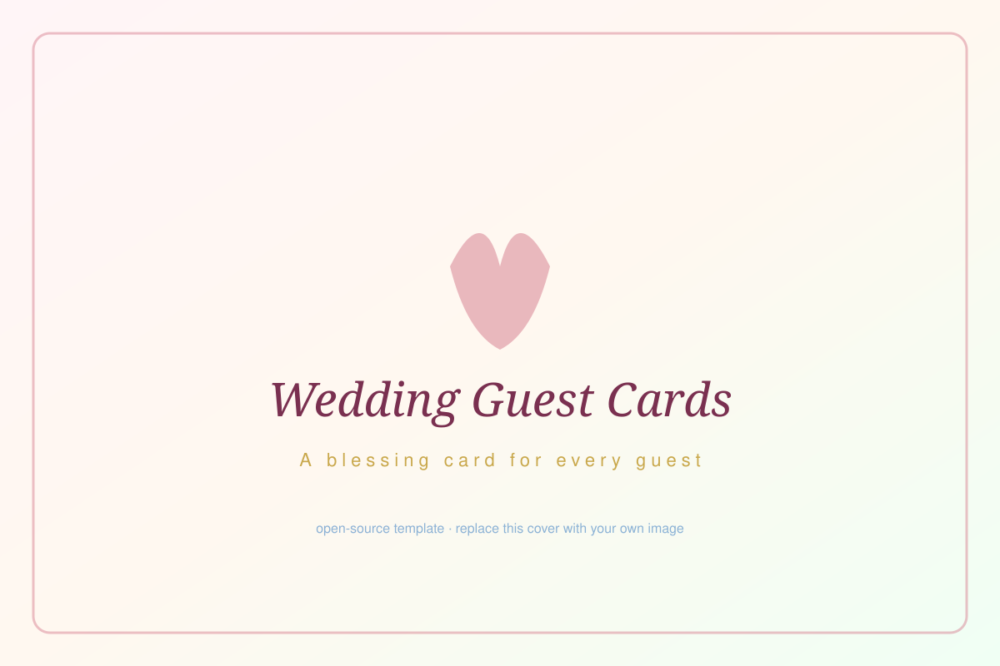

# Wedding Guest Cards · 婚禮賓客互動感謝卡

> 給每位賓客一張「會打開的信封 + 客製化祝福卡」的婚禮互動工具。賓客掃 QR Code → 輸入姓名電話 → 看到專屬於自己的卡片，含對方專屬訊息、照片與主題色。

[](./LICENSE)
[](https://nextjs.org/)
[](https://www.typescriptlang.org/)



---

## 兩種使用方式

### 🚀 方式一：直接用我做好的 SaaS 服務（懶人首選）

如果你不想自己跑程式碼、不想處理部署，可以直接用我做的 SaaS 服務：

**👉 [card.oharalab.com](https://card.oharalab.com)**

- 不用懂 coding，直接後台填賓客資料
- 內建主題編輯器、Excel 匯入、QR Code 產生
- 進階方案含 Email 寄送、卡片下載、自訂網域

### 🛠 方式二：自己 fork 這個 repo 改（DIY 工程師款）

如果你會一點程式（或想學），這個 repo 完整開源，可以 fork 回去改成自己想要的版本。本文檔接下來都是給這條路徑用的。

> ⚠️ **此 repo 為公開範例版**：所有賓客資料、訊息文字、圖片皆為示範用途，請於部署前替換為自己的內容。原本婚禮上的真實內容（我們親手寫給家人朋友的卡片）並未包含在此 repo 中。

---

## 功能總覽

- ✅ **姓名＋電話雙重驗證**：兩項都對才能看卡
- ✅ **5 種淡色主題**：classic（粉黃）、rose（粉紅）、midnight（粉藍）、spring（粉綠）、luxe（粉橘）
- ✅ **信封 3D 翻轉動畫**：純 CSS，行動裝置流暢
- ✅ **圖片支援**：0 張、1 張（居中）、2+ 張（雙列網格）
- ✅ **花瓣粒子動畫**：登入頁背景特效
- ✅ **Email 寄送 + 卡片下載**：賓客可下載卡片或寄到 email
- ✅ **安全防護**：Rate Limiting、Honeypot 反爬蟲、輸入驗證、XSS 防護
- ✅ **響應式設計**：手機 / 平板 / 桌面
- ✅ **零雲端依賴**：本機開發即可跑完整流程

---

## 快速開始（5 分鐘看到範例）

```bash
# 1. clone
git clone https://github.com/darrenlu86/wedding-guest-cards-public.git
cd wedding-guest-cards-public

# 2. 安裝依賴
npm install

# 3. 啟動開發伺服器
npm run dev
```

瀏覽器開啟 [http://localhost:3000](http://localhost:3000)，輸入下方範例帳號中任一組即可體驗。

### 範例帳號（10 組）

| # | 姓名 | 電話 | 主題 | 圖片數 |
|---|------|------|------|--------|
| 1 | 小明 | `0912000001` | classic（粉黃） | 1 |
| 2 | 小婷 | `0912000002` | classic（粉黃） | 2 |
| 3 | 玫君 | `0912000003` | rose（粉紅） | 0 |
| 4 | 思賢 | `0912000004` | rose（粉紅） | 1 |
| 5 | Alex Chen | `0912000005` | midnight（粉藍） | 1 |
| 6 | 佳穎 | `0912000006` | midnight（粉藍） | 2 |
| 7 | 志豪 | `0912000007` | spring（粉綠） | 0 |
| 8 | Jamie Lee | `0912000008` | spring（粉綠） | 1 |
| 9 | 怡君 | `0912000009` | luxe（粉橘） | 2 |
| 10 | 宏達 | `0912000010` | luxe（粉橘） | 1 |

> 賓客資料與祝福訊息定義於 [`lib/db.ts`](./lib/db.ts) 的 `seedTestData()`。範例圖片為 SVG 佔位插畫，放在 `public/sample-images/`。範例訊息口語化、有自嘲、不甜膩，可作為自訂時的語氣參考。

---

## 換成自己的內容（三大步驟）

### Step 1: 把照片放對位置

**📁 照片要放在哪？**

把你自己拍的賓客照片放進 `public/photos/` 資料夾：

```
public/
├── photos/                    ← 你的照片放這裡
│   ├── 王小明.jpg
│   ├── 01-王小明.jpg
│   ├── 02-李小華.jpg
│   ├── 03-Alex_Chen.jpg
│   ├── 我跟阿明的合照.jpeg
│   └── ...
├── couple-illustration.png    ← 新人似顏繪（換成你們的）
└── sample-cover.svg           ← 社群分享預覽圖（換成你們的）
```

**📛 命名規則建議**

1. **單純姓名**：`王小明.jpg`、`Alex_Chen.jpg`
2. **編號＋姓名**：`01-王小明.jpg`、`02-李小華.jpg`（方便排序）
3. **描述性命名**：`與阿明的合照.jpg`、`大學時期.jpg`
4. **避免**：`照片1.jpg`、`IMG_4523.jpg`（之後找不到誰是誰）

> ✅ 支援格式：`.jpg` / `.jpeg` / `.png` / `.webp` / `.svg` / `.avif`
> ✅ 建議尺寸：800×600 以上（直/橫向皆可，系統會自動裁切）
> ✅ 中文檔名 OK，會自動 URL encode

**📝 怎麼在卡片上引用照片？**

在 Excel 或 `lib/db.ts` 中填路徑時，用 `/photos/檔名` 開頭即可：

```
✅ /photos/王小明.jpg
✅ /photos/01-王小明.jpg
❌ photos/王小明.jpg          （少了開頭斜線）
❌ public/photos/王小明.jpg    （不要加 public/）
❌ ./photos/王小明.jpg         （不要加點號）
```

多張照片用逗號隔開（Excel）或陣列（JSON）：
- Excel：`/photos/01-王小明.jpg, /photos/02-王小明.jpg`
- JSON：`["/photos/01-王小明.jpg", "/photos/02-王小明.jpg"]`

---

### Step 2: 編輯賓客名單（Excel 流程）

我準備了一份 Excel 模板，這是最不需要碰程式碼的方式：

#### 2-1. 開啟模板

```bash
open data/guests-template.xlsx
```

或直接在 Finder / 檔案總管打開 `data/guests-template.xlsx`。

#### 2-2. 填寫賓客資料

模板長這樣（5 個欄位，第一列是欄位名不要動）：

| 姓名 | 電話 | 祝福訊息 | 主題 | 圖片 |
|------|------|----------|------|------|
| 王小明 | 0912345678 | 親愛的小明，\n感謝你的陪伴... | classic | /photos/01-王小明.jpg |
| 李小華 | 0987654321 | 親愛的小華，... | rose | /photos/02-李小華.jpg, /photos/02b-李小華.jpg |
| John Doe | 0922222222 | Dear John,... | spring |  |

**欄位說明：**

| 欄位 | 必填？ | 說明 |
|------|--------|------|
| **姓名** | ✅ 必填 | 用於登入驗證，需與賓客輸入完全一致 |
| **電話** | 選填 | 沒填的話只用姓名驗證 |
| **祝福訊息** | 選填 | 卡片中央顯示的內容，用 `\n` 換行（Excel 中按 Alt+Enter） |
| **主題** | 選填 | `classic` / `rose` / `midnight` / `spring` / `luxe`（不填預設 classic） |
| **圖片** | 選填 | 一張或多張，多張用 `, ` 逗號隔開。路徑要用 `/photos/檔名` 格式 |

#### 2-3. 另存為 `guests.xlsx`

```bash
# 把編輯好的檔案存成 data/guests.xlsx（不要存回 guests-template.xlsx）
```

#### 2-4. 跑匯入指令

```bash
npm run import:guests
```

指令會：
1. 讀取 `data/guests.xlsx`
2. 驗證每一列（姓名是否填、主題是否合法、圖片路徑是否存在等）
3. 生成 `lib/guests.json`
4. 印出匯入摘要（成功幾筆、警告幾筆）

#### 2-5. 切換 `lib/init.ts` 使用真實資料

打開 [`lib/init.ts`](./lib/init.ts)，把：

```ts
import { seedTestData, getAllGuests } from './db';
// ...
await seedTestData();
```

改成：

```ts
import { addGuest, getAllGuests } from './db';
import { Guest } from '@/types/guest';
import guestsData from './guests.json';
// ...
for (const guest of guestsData as Guest[]) {
  await addGuest(guest);
}
```

#### 2-6. 重新啟動 dev server

```bash
npm run dev
```

打開 http://localhost:3000，用你 Excel 中的真實姓名測試驗證 → 看到你的賓客卡片。✅

> 📌 **不想用 Excel？** 可以直接編輯 [`lib/db.ts`](./lib/db.ts) 中的 `seedTestData()`，把 10 組範例改成自己的賓客（適合 < 30 人的情況）。

---

### Step 3: 自訂新人名稱、主題色與品牌資訊

#### 3-1. 替換新人名稱

| 檔案 | 要改的內容 |
|------|------------|
| [`app/layout.tsx`](./app/layout.tsx) | `SITE_TITLE`、`SITE_URL`、`SITE_DESCRIPTION`、`keywords`、`authors` |
| [`app/card/[guestId]/layout.tsx`](./app/card/[guestId]/layout.tsx) | 卡片頁 OG meta（title、description、images） |
| [`app/page.tsx`](./app/page.tsx) 第 92 行 | 登入頁顯示的新人名稱 |
| [`components/BlessingCard/index.tsx`](./components/BlessingCard/index.tsx) 第 142 行 | 卡片簽名 |
| [`lib/email.ts`](./lib/email.ts) | `CARD_BASE_URL`、`SENDER_NAME`（寄信用） |

可以全域搜尋 `Alex & Jamie`、`your-domain.example.com` 一起替換。

#### 3-2. 替換新人似顏繪 / 封面圖

```
public/couple-illustration.png   ← 登入頁圓形似顏繪，建議 512×512
public/sample-cover.svg          ← OG / 社群分享預覽，建議 1200×800
```

#### 3-3. 客製化主題色

5 種主題定義於 [`components/BlessingCard/cardTemplates.ts`](./components/BlessingCard/cardTemplates.ts)：

```ts
{
  id: 'classic',
  card: { backgroundColor: '#fffbf0', ... },
  message: { background: '#fef3d4', border: '#e8d4a3', ... },
  text: { title: '#6b5a2a', body: '#3a3a3a', ... },
  accent: '#c9a84c',  // 邊框、分隔線、四角紋飾的主色
}
```

可以直接改 hex 值，或新增第 6 種主題（記得在 `lib/constants.ts` 也註冊新的 templateId）。

---

## 部署上線（三種選擇）

完成自訂後，把網站部署到網路上，賓客掃 QR Code 才能進入。

### 選項 A：Vercel（推薦，最簡單）

**優點**：免費、零設定、支援 API routes、自動 HTTPS、全球 CDN。

**步驟**：

1. 把你的 fork 推到自己的 GitHub repo
2. 到 [vercel.com/new](https://vercel.com/new) 選你的 repo
3. 點 Deploy（連環境變數都不用設，預設就能跑）
4. 拿到網址（例：`your-wedding.vercel.app`）

**選用環境變數**（要寄送 Email 才需要）：

```env
SMTP_HOST=smtp.gmail.com
SMTP_PORT=587
SMTP_USER=your@gmail.com
SMTP_PASS=your-app-password
SMTP_FROM="新人姓名 <your@gmail.com>"
```

### 選項 B：Cloudflare Pages / Workers（免費、適合自訂網域）

**優點**：免費、可綁自訂網域（如 `our-wedding.com`）、全球 CDN、Edge Worker 含 API。

**步驟**：

1. 安裝 OpenNext adapter（已內建於 deps）
2. Build：
   ```bash
   npm run build
   npx opennextjs-cloudflare deploy
   ```
3. 在 Cloudflare Dashboard 綁自訂網域

詳見 [Cloudflare Next.js 部署文件](https://developers.cloudflare.com/pages/framework-guides/nextjs/)。

### 選項 C：GitHub Pages（純靜態，受限）

**⚠️ 注意**：GitHub Pages 只支援靜態網站，沒有伺服器。本專案的 API routes（`/api/verify-guest`、`/api/card-data`、`/api/send-email`）**無法**直接運作。

如果一定要用 GitHub Pages，需要做大幅改動：
1. 把賓客 JSON 直接 embed 進前端（賓客名單會對外可見，有隱私風險）
2. 改用 `next export` 產生靜態檔
3. 失去 rate limiting、honeypot、email 寄送等保護

> 👉 **建議**：除非你能接受名單對外可見，否則選 Vercel 或 Cloudflare。

### 選項 D：完全不想處理部署？

回到上方 → 用 [**card.oharalab.com**](https://card.oharalab.com) SaaS 服務，5 分鐘搞定。

---

## QR Code 設定

婚禮現場印一張 QR Code 大牌或桌卡，指向你部署後的網址：

```bash
# 用 CLI 產生（需要 Node.js）
npx qrcode "https://your-wedding.vercel.app" -o qr.png -w 1200

# 或用線上工具
# https://www.qr-code-generator.com/
```

建議把 QR Code 印在 1200×1200 像素以上、邊長 ≥ 5 公分的紙板上。

---

## Email 寄送設定（選用）

如果要讓賓客可以把卡片寄到自己 email，需要設定 SMTP（見上方環境變數）。

**Gmail 設定步驟：**

1. 帳號開啟 2FA
2. 到 [Google 應用程式密碼](https://myaccount.google.com/apppasswords) 產生 16 碼密碼
3. 把這 16 碼填到 `SMTP_PASS`

不設定也沒關係，卡片下載 / 顯示功能不受影響。

---

## 技術棧

- **前端**：Next.js 16 (App Router) + React 19 + TypeScript + Tailwind CSS 4
- **動畫**：純 CSS Animations + CSS Modules（信封 3D 翻轉、花瓣粒子）
- **儲存**：記憶體 Map（開發用）；正式環境建議 Vercel KV / Redis / Supabase
- **驗證**：自寫姓名＋電話雙驗證 + Honeypot 反爬蟲 + IP Rate Limiting
- **Email**：Nodemailer + SMTP
- **截圖 / 下載**：html-to-image
- **測試**：Vitest + Testing Library

---

## 專案架構

```
wedding-guest-cards-public/
├── app/                          # Next.js App Router
│   ├── page.tsx                  # 驗證入口
│   ├── card/[guestId]/           # 卡片展示頁
│   └── api/
│       ├── verify-guest/         # 姓名＋電話驗證
│       ├── card-data/            # 卡片資料 API
│       └── send-email/           # 寄送 Email
├── components/
│   ├── BlessingCard/             # 祝福卡片（含主題系統）
│   ├── EnvelopeAnimation/        # 信封 3D 翻轉動畫
│   ├── VerificationForm/         # 驗證表單
│   ├── DownloadButton/           # 卡片下載
│   ├── EmailShareButton/         # Email 分享
│   └── PetalRain.tsx             # 花瓣粒子背景
├── lib/
│   ├── db.ts                     # 記憶體儲存 + 10 組範例 seedTestData()
│   ├── validation.ts             # 輸入驗證
│   ├── rate-limit.ts             # IP rate limit
│   ├── email.ts                  # Nodemailer 封裝
│   ├── capture-card.ts           # 卡片截圖
│   ├── constants.ts              # 主題 ID 常數
│   └── init.ts                   # 範例資料初始化
├── data/
│   └── guests-template.xlsx      # Excel 模板（填寫後另存 guests.xlsx）
├── public/
│   ├── couple-illustration.png   # 新人似顏繪
│   ├── sample-cover.svg          # OG 封面
│   ├── sample-images/            # 10 張範例插畫
│   └── photos/                   # 你自己的照片放這裡
├── scripts/
│   ├── import-guests.ts          # Excel → JSON 匯入
│   ├── init-data.ts              # seed 範例資料
│   ├── parse-tables.ts           # 桌次表解析（可選）
│   └── enrich-guests.ts          # 賓客資料補強（可選）
└── tests/                        # Vitest 測試
```

---

## 常見問題

**Q: 我的賓客輸入姓名後說「查無資料」？**
A: 確認賓客姓名與 `lib/guests.json` 或 `lib/db.ts` 中的 `name` 完全一致（包含繁簡、空格）。系統會做大小寫不敏感與 trim 處理，但不會做模糊比對。

**Q: 為什麼我改了 Excel 但網站沒變？**
A: 改完 Excel 後要記得跑 `npm run import:guests` 重新生成 `lib/guests.json`，然後重啟 dev server (`Ctrl+C` 後再 `npm run dev`)。

**Q: 圖片顯示破圖？**
A: 檢查三件事：
1. 照片是否放在 `public/photos/` 底下
2. 路徑寫法是否為 `/photos/檔名.jpg`（不要加 `public/`）
3. 副檔名大小寫是否一致（macOS 不敏感、Linux 部署敏感）

**Q: 為什麼 Tailwind 某些 class 沒生效？**
A: `globals.css` 中的 `* { padding: 0; margin: 0; }` 會覆蓋 Tailwind utility class。對於關鍵間距，請改用 inline style（見 `app/page.tsx` 範例）。

**Q: 部署後賓客資料怎麼處理？**
A: 預設使用記憶體儲存，每次 cold start 會重新跑 init。如果賓客名單會更新（RSVP 變動），建議改用 Vercel KV 或外部資料庫。

**Q: 可以拿來做商業用途嗎？**
A: 本專案使用 **PolyForm Noncommercial 1.0.0** 授權，**禁止商業用途**。個人 / 非商業使用（自己的婚禮、研究、學習）皆可。若要用於商業專案（接案、SaaS、付費服務等），請來信聯絡作者討論授權。

---

## 開發指令

```bash
npm run dev             # 開發伺服器（http://localhost:3000）
npm run build           # 建置生產版本
npm start               # 啟動生產伺服器
npm run import:guests   # Excel → JSON 匯入
npm run init:data       # 載入 10 組範例資料（測試用）
npm test                # 執行 Vitest 測試
npm run test:ui         # 測試 UI 介面
npm run test:coverage   # 測試覆蓋率
```

---

## 授權

**[PolyForm Noncommercial License 1.0.0](./LICENSE)**

- ✅ 個人 / 非營利用途自由使用、修改、散布
- ✅ 自己的婚禮、研究、學習、實驗
- ✅ 慈善、教育、政府機構
- ❌ 商業用途（接案、SaaS、付費服務等）
- ❌ 任何以營利為目的的散布

**商業授權洽詢：📧 kevin868686@gmail.com**

或直接使用 SaaS 版本 → [card.oharalab.com](https://card.oharalab.com)

---

## 貢獻

歡迎開 issue 或 PR 改善：
- Bug 回報
- 新主題色
- 新動畫效果
- 文件改善

但請注意，貢獻內容將以 PolyForm Noncommercial 1.0.0 授權釋出。

---

## 作者

Made with 💛 by [Darren Lu](https://github.com/darrenlu86)

如果這個專案對你的婚禮（或任何個人專案）有幫助，歡迎 ⭐ Star 或來信跟我說一聲，我會很開心！

也歡迎追蹤我的其他作品：
- [card.oharalab.com](https://card.oharalab.com) — 婚禮感謝卡 SaaS
- [invite.oharalab.com](https://invite.oharalab.com) — 婚禮邀請函 SaaS
- [game.oharalab.com](https://game.oharalab.com) — 婚禮互動遊戲 SaaS

